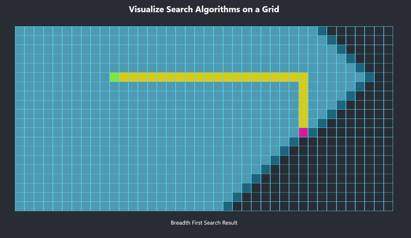

# Search Visualizer

A learning project in React, inspired by Clément Mihailescu's
[Pathfinding Visualizer](https://github.com/clementmihailescu/Pathfinding-Visualizer). The main project goal is to get some experience with
React beyond tutorials. To that end, I've avoided referencing the repository above or the development process "tutorial" that goes with it.

Hopefully this project is interesting enough to be realistic and to enable creativity, without requiring a huge scope to be completed.

This project was bootstrapped with [Create React App](https://github.com/facebook/create-react-app).

## Technology
* React
* Typescript

## Available Scripts

In the project directory, you can run:

### `yarn start`

Runs the app in the development mode. 
Open [http://localhost:3000](http://localhost:3000) to view it in the browser.

The page will reload if you make edits. 
You will also see any lint errors in the console.

### `yarn test`

Launches the test runner in the interactive watch mode. 
See the section about [running tests](https://facebook.github.io/create-react-app/docs/running-tests) for more information.

### `yarn build`

Builds the app for production to the `build` folder. 
It correctly bundles React in production mode and optimizes the build for the best performance.

The build is minified and the filenames include the hashes. 
Your app is ready to be deployed!

See the section about [deployment](https://facebook.github.io/create-react-app/docs/deployment) for more information.

## Learn More

To learn React, check out the [React documentation](https://reactjs.org/).
